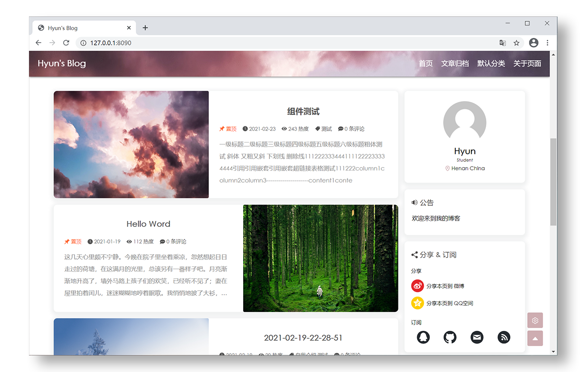

# Halo Theme Yun



## 特点

- [x] 已适配 PC、PAD、手机
- [x] CSS、JS 已进行兼容处理，浏览器兼容性较好
- [x] 支持个性化主题颜色修改、夜间模式、图片轮播、阅读进度等等
- [x] ~~想了大半天整出来的效果不错性能拉胯的封面+导航条~~


## 关于本主题

> 第一次写主题, 甚至也是第一次写这种规模的前端项目, 难免出现错误与疏漏, 欢迎提交 PR、Issue 共同改进这个主题

本主题目前还尚不完善, 有许多细节做得不够好, 慢慢优化, 如果你觉得还不错可以点个 star 支持一下


## 主题再开发

1. JS、SASS 源文件路径为 ```source/.dev```
2. 使用 ```npm install``` 下载所需文件
3. 使用 ```npm run build``` 进行构建


## Q & A
### 主页怎么那么像 hexo 的 butterfly主题?
没错, 主页布局的灵感就是来自 [hexo-theme-butterfly](https://github.com/jerryc127/hexo-theme-butterfly) 这个优秀的主题

### 主页卡片太少了吧, ~~而且很多都是凑数~~?
实在想不出加什么卡片比较好了, 如果你很有想法, 欢迎提交Issue